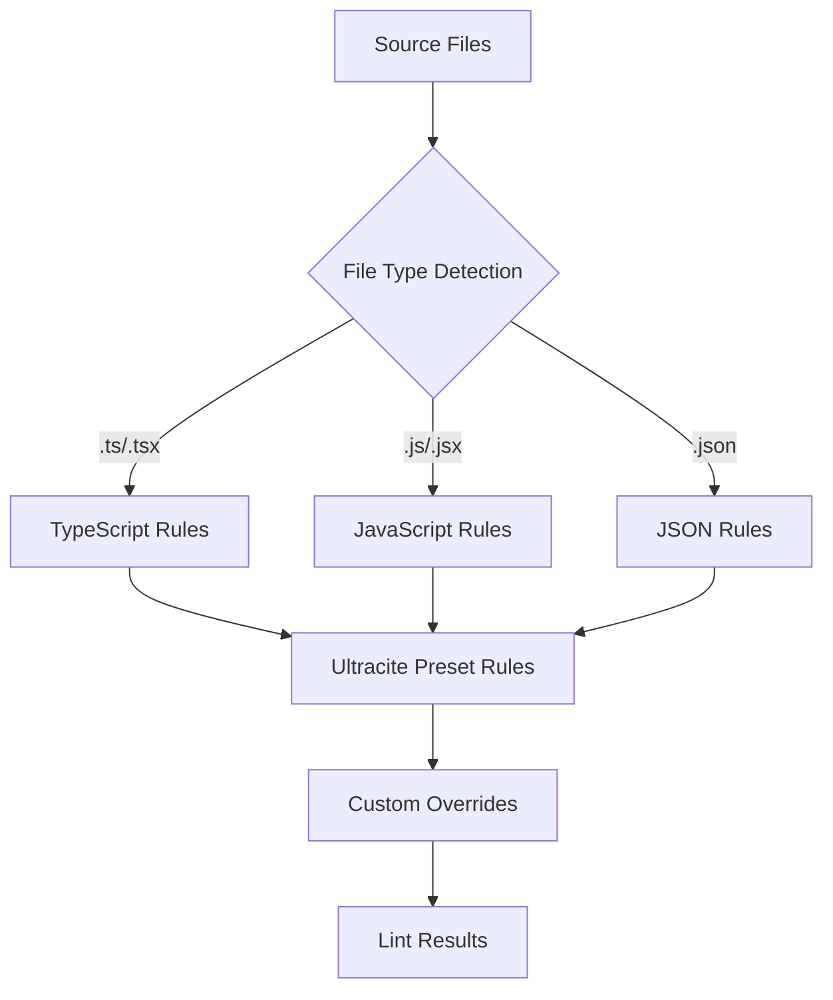
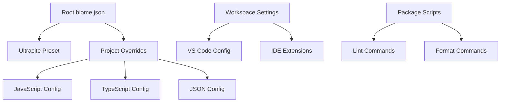
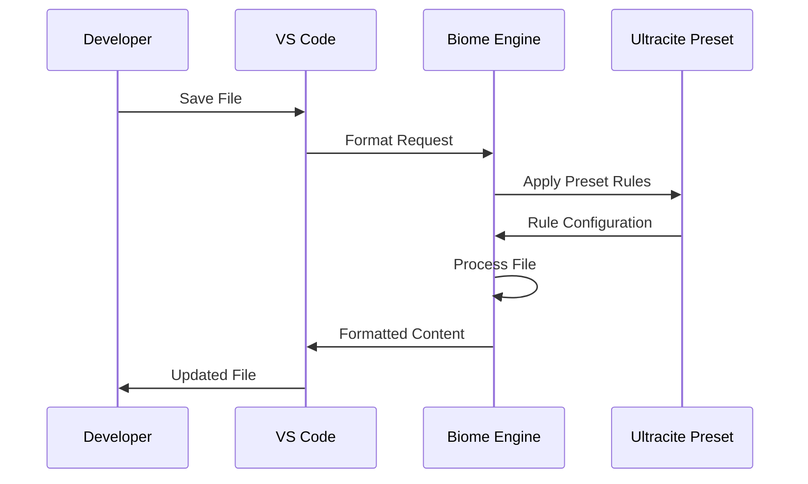
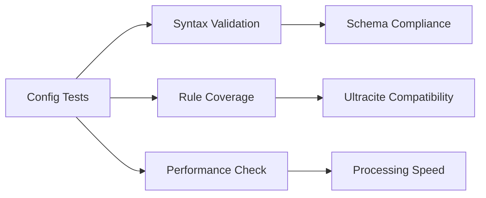

# Biome Configuration Design

## Overview

This design document outlines the configuration setup for Biome with the ultracite preset to ensure proper formatting on save and linting functionality in the my-better-t-app project. The goal is to establish a consistent, automated code quality and formatting system across the entire monorepo.

## Technology Stack & Dependencies

### Core Tools
- **Biome v2.1.2**: Unified linter and formatter for JavaScript/TypeScript
- **Ultracite v5.1.2**: Opinionated Biome configuration preset
- **Turborepo**: Monorepo task orchestration
- **Bun**: Package manager and runtime

### IDE Integration
- **VS Code**: Primary IDE with Biome extension
- **Other IDEs**: Support for WebStorm, Neovim, and other editors

## Current Configuration Analysis

### Existing Biome Configuration (`biome.json`)
```json
{
  "$schema": "https://biomejs.dev/schemas/2.1.2/schema.json",
  "files": {
    "ignoreUnknown": false,
    "includes": [
      "**",
      "!**/.next",
      "!**/dist",
      "!**/.turbo",
      "!**/dev-dist",
      "!**/.zed",
      "!**/.vscode",
      "!**/routeTree.gen.ts",
      "!**/src-tauri",
      "!**/.nuxt",
      "!bts.jsonc",
      "!**/.expo",
      "!**/.wrangler",
      "!**/.source"
    ]
  },
  "extends": ["ultracite"],
  "javascript": {
    "formatter": {
      "semicolons": "asNeeded"
    }
  }
}
```

### Current VS Code Configuration (`.vscode/settings.json`)
```json
{
  "editor.defaultFormatter": "biomejs.biome",
  "editor.formatOnSave": true,
  "editor.formatOnPaste": true,
  "editor.codeActionsOnSave": {
    "source.fixAll.biome": "explicit",
    "source.organizeImports.biome": "explicit"
  }
}
```

## Configuration Enhancement Strategy

### 1. Enhanced Biome Configuration

#### File Processing Rules
- **Include patterns**: Process all TypeScript, JavaScript, JSON, and JSX files
- **Exclude patterns**: Skip build artifacts, IDE files, and generated code
- **Unknown file handling**: Configure proper handling for files without explicit rules

#### Linting Configuration


#### Formatter Configuration
- **Semicolon usage**: "asNeeded" for minimal syntax
- **Quote style**: Consistent double quotes
- **Indentation**: 2 spaces for all file types
- **Line width**: 80 characters for readability
- **Trailing commas**: "es5" for compatibility

### 2. IDE Integration Setup

#### VS Code Configuration Enhancement
```json
{
  "editor.defaultFormatter": "biomejs.biome",
  "editor.formatOnSave": true,
  "editor.formatOnPaste": true,
  "editor.formatOnType": false,
  "editor.codeActionsOnSave": {
    "source.fixAll.biome": "explicit",
    "source.organizeImports.biome": "explicit"
  },
  "[javascript]": {
    "editor.defaultFormatter": "biomejs.biome"
  },
  "[typescript]": {
    "editor.defaultFormatter": "biomejs.biome"
  },
  "[javascriptreact]": {
    "editor.defaultFormatter": "biomejs.biome"
  },
  "[typescriptreact]": {
    "editor.defaultFormatter": "biomejs.biome"
  },
  "[json]": {
    "editor.defaultFormatter": "biomejs.biome"
  },
  "[jsonc]": {
    "editor.defaultFormatter": "biomejs.biome"
  }
}
```

#### Extension Requirements
- **Biome Extension**: `biomejs.biome` (latest version)
- **Auto-installation**: Include in recommended extensions

### 3. Monorepo Integration

#### Turborepo Task Configuration
```json
{
  "lint": {
    "outputs": [],
    "cache": false
  },
  "lint:fix": {
    "outputs": [],
    "cache": false
  },
  "format": {
    "outputs": [],
    "cache": false
  },
  "format:check": {
    "outputs": [],
    "cache": false
  }
}
```

#### Package Scripts Enhancement
```json
{
  "scripts": {
    "check": "biome check --write .",
    "check:ci": "biome check .",
    "lint": "biome lint .",
    "lint:fix": "biome lint --write .",
    "format": "biome format --write .",
    "format:check": "biome format ."
  }
}
```

### 4. Workspace-Specific Configuration

#### Apps/Web Configuration
- **React-specific rules**: JSX formatting and linting
- **Next.js compatibility**: Handle App Router patterns
- **Tailwind integration**: Class name formatting

#### Apps/Server Configuration
- **Node.js patterns**: Server-side code formatting
- **API route handling**: Consistent endpoint formatting
- **Database integration**: Prisma schema formatting

## Implementation Architecture

### Configuration Hierarchy


### File Processing Pipeline


### Error Handling Strategy

#### Linting Error Categories
- **Syntax Errors**: Critical issues that break compilation
- **Style Violations**: Formatting inconsistencies
- **Best Practices**: Code quality improvements
- **Import Organization**: Module import/export optimization

#### Auto-fix Capabilities
- **Formatting**: Automatic code style corrections
- **Import sorting**: Alphabetical and logical organization
- **Simple fixes**: Remove unused variables, fix quotes
- **Manual review**: Complex logic issues requiring developer attention

## Testing Strategy

### Configuration Validation


### IDE Integration Testing
- **Format on save**: Verify automatic formatting triggers
- **Lint on type**: Check real-time error detection
- **Import organization**: Test automatic sorting functionality
- **Error display**: Validate inline error indicators

### CI/CD Integration
- **Pre-commit hooks**: Format and lint before commits
- **Pull request checks**: Automated quality gates
- **Build pipeline**: Integrate with Turborepo tasks
- **Performance monitoring**: Track processing times

## Troubleshooting Guide

### Common Issues

#### Format on Save Not Working
- **Check extension**: Ensure Biome extension is installed and enabled
- **Verify settings**: Confirm `editor.formatOnSave` is true
- **Default formatter**: Set Biome as default for file types
- **Configuration errors**: Validate biome.json syntax

#### Linting Rules Not Applied
- **Ultracite loading**: Verify preset is properly extended
- **File inclusion**: Check file patterns in configuration
- **Cache issues**: Clear Biome cache and restart IDE
- **Version compatibility**: Ensure Biome and ultracite versions match

#### Performance Issues
- **File exclusions**: Optimize ignore patterns
- **Large files**: Configure processing limits
- **Memory usage**: Monitor IDE resource consumption
- **Workspace size**: Consider splitting large monorepos

### Diagnostic Commands
```bash
# Check configuration validity
biome check --verbose

# Display applied configuration
biome config

# Clear cache
biome cache clear

# Run with detailed logging
biome check --log-level=debug
```

## Migration Strategy

### Phase 1: Configuration Setup
1. Update biome.json with enhanced settings
2. Configure VS Code workspace settings
3. Install required extensions
4. Test basic formatting functionality

### Phase 2: Monorepo Integration
1. Add Turborepo task definitions
2. Update package.json scripts
3. Configure workspace-specific rules
4. Test across all applications

### Phase 3: Automation & CI/CD
1. Set up pre-commit hooks
2. Integrate with pull request workflows
3. Add performance monitoring
4. Document troubleshooting procedures

### Phase 4: Team Onboarding
1. Create setup documentation
2. Provide IDE configuration guides
3. Establish coding standards
4. Monitor adoption and feedback

## Maintenance Considerations

### Regular Updates
- **Biome versions**: Keep current with latest releases
- **Ultracite updates**: Monitor preset changes and improvements
- **IDE extensions**: Update Biome extension regularly
- **Configuration tuning**: Adjust rules based on team feedback

### Performance Monitoring
- **Processing times**: Track format/lint execution speed
- **Memory usage**: Monitor IDE resource consumption
- **File processing**: Optimize include/exclude patterns
- **Team productivity**: Measure impact on development workflow

### Documentation Maintenance
- **Configuration changes**: Document all modifications
- **Troubleshooting updates**: Add new solutions as discovered
- **Team guidelines**: Keep coding standards current
- **Migration notes**: Record upgrade procedures